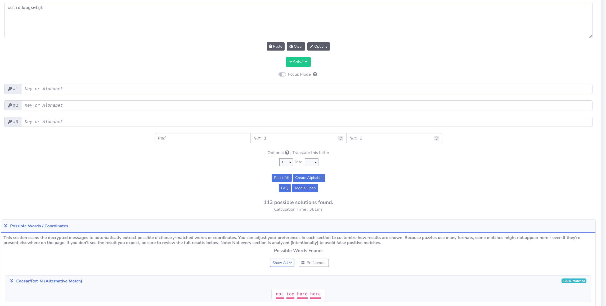

# walkthrough of level00

this is a basic level which requires a little of fiddeling in the file system and looking for some indication of where the flag might be

## file search

in this level i started searching for files accessible to the users `flag00` and `level00` with the command `find` in the following manner

```
find / -user level00 2>/dev/null
```

i find all the files accessbile to this user but they are all proc related files so i used the other user `flag00` to look for something

```
find / -user flag00 2>/dev/null
```

and i found these files :

```
/usr/sbin/john
/rofs/usr/sbin/john
```

and i diplayed the content of those files to find the following :

```
level00@SnowCrash:~$ cat /usr/sbin/john /rofs/usr/sbin/john
cdiiddwpgswtgt
cdiiddwpgswtgt
level00@SnowCrash:~$ 
```

that seems like some type of cipher so i went to https://www.cachesleuth.com/multidecoder/ and i pasted the text to get this 



i get that it is a caesar cipher / rot-n and to be exact a rot 15 type

after we change user to `flag00` and execute `getflag` command to get the to the next level

```
level00@SnowCrash:~$ su flag00
Password: 
Don't forget to launch getflag !
flag00@SnowCrash:~$ getflag
Check flag.Here is your token : x24ti5gi3x0ol2eh4esiuxias
flag00@SnowCrash:~$ 
```