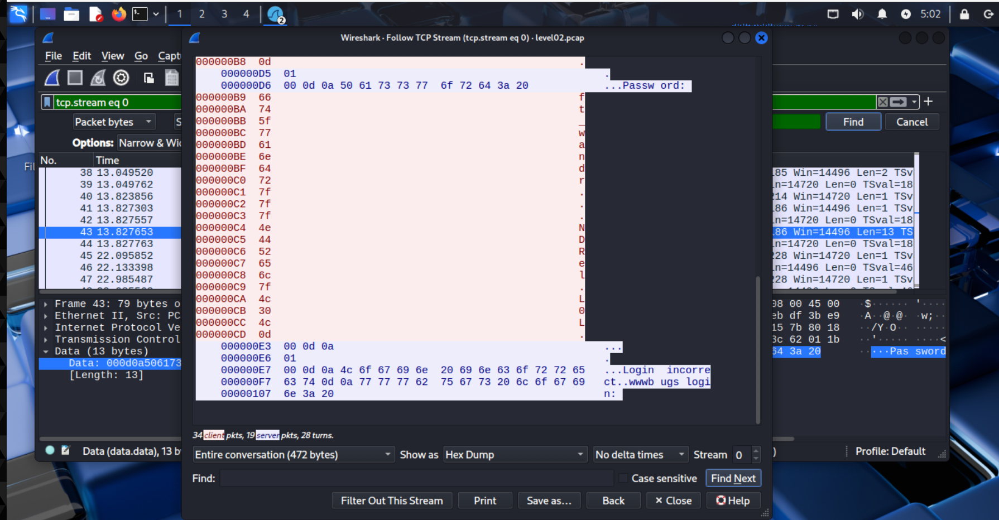

# level02 walkthrough

in this level we are given a file in the home directory
```
level02@SnowCrash:~$ ls
level02.pcap
```

after further inspection we find that it is a Packet Capture files that store network traffic information. They capture the raw data of network packets, including headers and payloads, allowing for detailed analysis of network activity

we need to inspect the content of this file and try to find something usefull, and for that we are going to use Wireshark. Wireshark is a widely used, open source network analyzer that can capture and display real-time details of network traffic

but first we need to copy the file from a our snowcrash machine to our kali machine

```
scp -P 4242 level02@192.168.56.101:/home/user/level02/level02.pcap .
```

and  change the permission of that file 

```
chmod 777 level02.pcap
```

and copy it into kali machine

```
scp ./level02.pcap kali@10.13.100.25:/home/kali/
```

after it we load it to wireshark. after loading it we look for data like credential and we use plaintext for that and search for any credential related keywords

after a while we find something with the keyword password 


and we click on data and select the follow option which will give us an option of tcp stream


after we will get the data in form of hex dump and there we can see the password




we will copy the passowrd `ft_wandr...NDRel.L0L.` and see the results

```
level02@SnowCrash:~$ su flag02
Password:
su: Authentication failure
```

something is not right. after inspecting the password in wireshark and see the hex value of each character we find out that some of there characters are non-printable characters

```
7f -> DEL
0d -> Carriage Return (CR) 
```

the new password will become like this after applying what we found out `ft_waNDReL0L`

```
level02@SnowCrash:~$ su flag02
Password: ft_waNDReL0L
Don't forget to launch getflag !
```

and we execute getflag

```
flag02@SnowCrash:~$ getflag
Check flag.Here is your token : kooda2puivaav1idi4f57q8iq
flag02@SnowCrash:~$
```

and now we get the flag to get to the next level.
